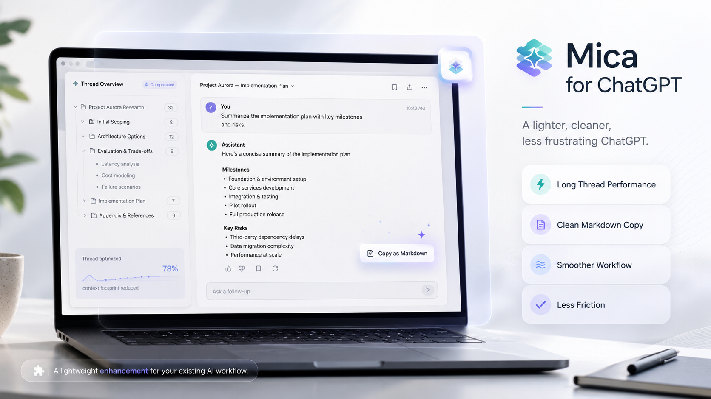
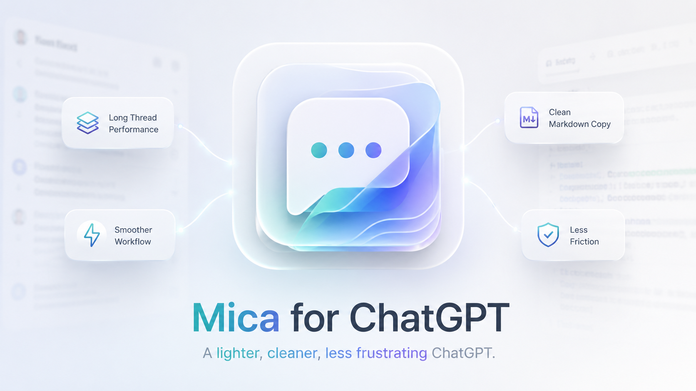

# Mica for ChatGPT

> A lighter, cleaner, less frustrating ChatGPT.



Mica 是一个面向 ChatGPT 网页端的浏览器扩展。目标不是重做 ChatGPT，而是在原生界面之上补上几个长期影响使用体验的问题：长对话性能、可靠的 Markdown/LaTeX 复制、烦人的重复确认与重试、以及少量真正有价值的界面增强。

当前最高优先级不是“做完整产品”，而是先恢复一个**今天就能长期使用的长对话优化扩展**。最近 ChatGPT 的长对话加载方式发生变化，LightSession 会停留在 `waiting for messages...`，导致旧的裁剪逻辑失效；在较弱设备上，超长 thread 又会明显拖慢页面。

## 当前目标：v0.1 Long-thread Recovery

第一阶段只解决一件事：让当前 ChatGPT 的长 thread 在 Chrome / Edge / macOS Chromium 浏览器上重新保持流畅，同时不破坏 ChatGPT 自己的新分段加载、工具调用、文件授权、分支、编辑消息和正在生成的回答。

实现原则：

- 先复现 LightSession 当前失效的具体原因，再决定最小修复路径。
- 不盲目沿用旧的 `/backend-api/conversation/<id>` 响应裁剪假设。
- 优先利用 ChatGPT 现在已经存在的原生分段加载，只优化浏览器端仍然造成卡顿的 DOM、布局和渲染成本。
- 如果当前接口仍可安全裁剪，可以保留兼容层；如果接口已经变化，则以 DOM/渲染虚拟化为主。
- 所有优化必须 fail-open：识别失败时宁可不优化，也不能破坏对话内容或交互。
- v0.1 先支持手动加载 unpacked extension，不等待商店发布。

详细执行方案见 [`docs/PHASE_1_LONG_THREAD_RECOVERY.md`](docs/PHASE_1_LONG_THREAD_RECOVERY.md)。整体路线见 [`docs/ROADMAP.md`](docs/ROADMAP.md)。

## v0.1 候选版安装

当前可加载的 unpacked extension 目录是：

```text
D:\Code\Mica-for-ChatGPT\dist\mica-v0.1.0
```

重新构建：

```bash
npm run build
```

Chrome / Edge 手动安装：

1. 打开 `chrome://extensions` 或 `edge://extensions`。
2. 开启 Developer mode。
3. 点击 Load unpacked。
4. 选择 `D:\Code\Mica-for-ChatGPT\dist\mica-v0.1.0`。
5. 打开或刷新 `https://chatgpt.com/` 的长 conversation。

页面右下角会显示状态：

- `Active`：Mica 确实对当前 mounted 的离屏 turn 应用了额外 containment。
- `Native virtualization`：ChatGPT 看起来已经只保留一个较小 mounted conversation window。
- `Native only`：当前页面保持原生渲染；这里观察到的数字只是实时 mounted DOM turns，不代表完整 thread 长度。
- `Degraded`：疑似 conversation 页面，但 Mica 无法安全识别 mounted turn 结构，已停止优化并保持原生页面。
- `Disabled`：用户在 popup 或页面状态条中关闭了 Mica。

页面上的常驻状态入口从 `v0.1.0-alpha.3` 起默认是 compact indicator。首次初始化、状态变化、进入 `Active` / `Degraded` 或用户点击时，会短暂展开完整状态，约 2–3 秒后自动收缩。overlay 会根据当前可见 composer 区域重新定位，避免覆盖输入框、发送按钮和语音按钮。

最短诊断路径：

```js
document.documentElement.dataset.micaStatus
document.documentElement.dataset.micaMountedTurns
document.documentElement.dataset.micaOptimizedTurns
```

popup 可切换启用状态、状态条显示、保留原生渲染的最近 turn 数量、已知安全提示自动 dismiss，并提供本地 diagnostics：

- `Start diagnostics`
- `Stop diagnostics`
- `Copy report`
- `Reset`

diagnostics report 只统计 mounted turn 数、DOM node 数、mutation/long task/frame stall/heap/complexity、overlay placement 和已知提示 dismiss count 等指标，不复制聊天正文或附件内容，不上传 telemetry。

Reliability 仅处理显式 allowlist 中的纯 acknowledgement 提示。当前 `Auto-dismiss known interruptions` 默认开启，可自动 dismiss 已知中文 “请求过于频繁 / 访问对话记录 / 明白了” 弹窗；成功处理后显示 2–3 秒非阻塞 toast。它不会 retry、reload、重新发送请求、切换 conversation，也不会处理未知确认、授权、删除、支付或工具权限弹窗。

## v0.1 当前限制

- 默认不修改 ChatGPT 私有 API response，也不阻止 network request。
- 不删除 React 管理的消息节点；这一版只用 `content-visibility:auto`、containment 和 intrinsic-size 降低离屏历史 turn 的渲染成本。
- 真实登录态 Edge 已确认当前 ChatGPT 已经原生 virtualize conversation；Mica 的 containment 现在只是低风险 fallback，`v0.1.0-alpha.3` 主要用于真实长 thread runtime diagnostics，并加入低干扰 overlay 与严格 allowlist 的已知提示自动 dismiss。
- 工具卡片、文件/授权类 UI、正在编辑的内容、viewport 附近内容和最近 turn 会保持原生渲染。
- Codex 当前只能访问未登录 ChatGPT 首页，不能在本机完成真实 authenticated long thread 回归；真实验收需要在目标 Chrome / Edge / MacBook Neo 上完成。
- 旧 LightSession 失效调查见 [`docs/investigations/2026-09-01-lightsession-current-chatgpt.md`](docs/investigations/2026-09-01-lightsession-current-chatgpt.md)。

## v0.1 本地验证

```bash
npm run build
npm run test:fixture
npm test
npm run package:release
```

本地 synthetic 90-turn fixture 只能证明 Mica 自己的 containment/fail-open 实现、manifest、icons、diagnostics message surface 和 release ZIP 结构工作；它不能证明 Mica 对当前真实 ChatGPT 长 conversation 有性能收益。真实 P0 性能结论必须来自 8 GB MacBook Neo。

## 真实设备更新：ChatGPT 已原生窗口化

2026-09-01 在真实登录态 Edge + 一个实际很长的 CUHK Date conversation 上验证：虽然逻辑 thread 可以持续向上滚动直到顶部，当前 DOM 中只维持约 5–9 个 mounted turns，并在滚动时小范围波动。这说明当前 ChatGPT 已经原生实现 conversation windowing / virtualization。

因此 P0 下一步不是简单降低 Mica 的 turn threshold，而是增加本地 runtime diagnostics，在实际出现卡顿的 8 GB MacBook Neo 上确认真正瓶颈。详细观察见 [`docs/investigations/2026-09-01-native-virtualization-real-device.md`](docs/investigations/2026-09-01-native-virtualization-real-device.md)，实现任务见 [Issue #2](https://github.com/YuukiAS/Mica-for-ChatGPT/issues/2)。

## Release 与安装包

当前 `dist/mica-v0.1.0/` 可直接用于 `Load unpacked`。GitHub Release 则应提供版本化 ZIP，而不是只让用户下载仓库目录；ZIP 解压后根目录应直接出现 `manifest.json`。首个对外包在 8 GB MacBook Neo 完成 P0 验收前应标为 pre-release。

当前 package 输出：

```text
release/mica-for-chatgpt-v0.1.0-alpha.3.zip
release/mica-for-chatgpt-v0.1.0-alpha.3.sha256
```

详细规则见 [`docs/RELEASE_PACKAGING.md`](docs/RELEASE_PACKAGING.md)。

## Branding

品牌说明见 [`docs/BRANDING.md`](docs/BRANDING.md)。扩展图标资产规范见 [`docs/ICON_ASSETS.md`](docs/ICON_ASSETS.md)。

产品主视觉：[`assets/branding/mica-product-hero.png`](assets/branding/mica-product-hero.png)

品牌/图标概念图：



## 后续方向

在长对话性能稳定后，再逐步加入：

1. **Copy & Export**：复制为稳定、可预测的 Markdown，正确处理代码块、表格、列表、LaTeX、引用与附件信息。
2. **Reliability**：识别可安全恢复的限流/失败状态，减少无意义的手动确认与重复点击，但绝不绕过真正需要用户授权的安全确认。
3. **Interface**：只做能明显降低摩擦的 ChatGPT UI 调整，不做大规模皮肤化。
4. **Diagnostics**：显示当前 thread 的优化状态、已虚拟化消息数量、性能降级原因，并提供一键关闭模块的能力。

## 项目边界

Mica 默认本地运行，不上传聊天内容，不要求外部后端。任何需要读取页面内容的功能都应尽量限制在 `chatgpt.com` 必要范围内，并保持权限最小化。
